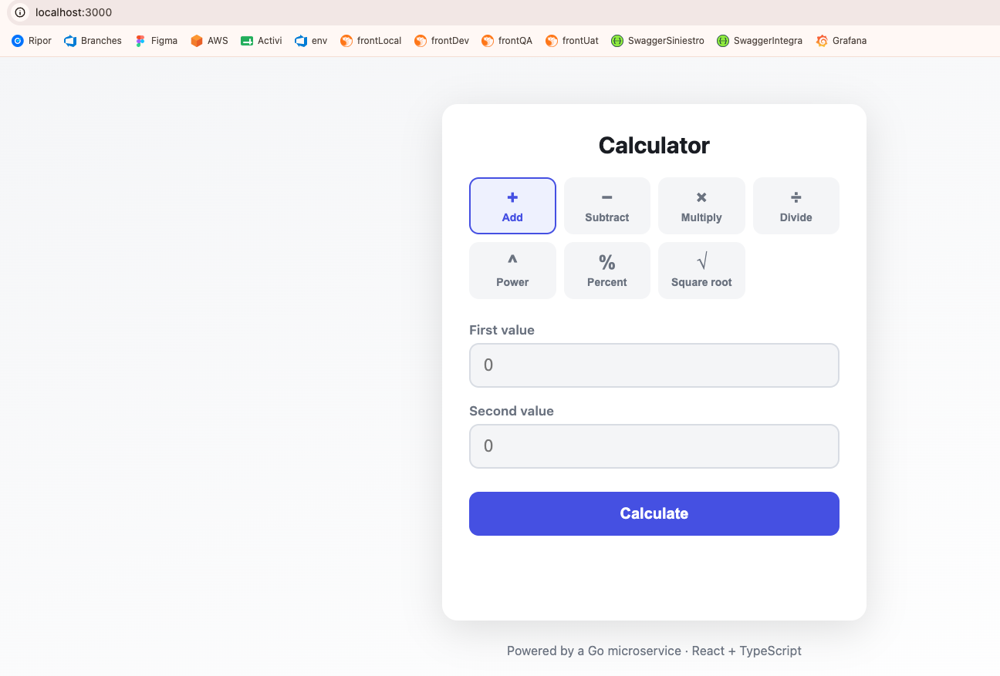

# Full-Stack Calculator

A calculator application with a **React + TypeScript** frontend and a **Go** REST
microservice backend. The frontend collects and validates input, calls the API,
and renders the result; the backend owns the arithmetic and is the authoritative
source of validation and edge-case handling.

Supported operations: **add, subtract, multiply, divide, power, percentage,
square root**.

**Repository:** https://github.com/ingeniero12345/calculator-app



```
┌─────────────────────┐        POST /api/v1/{op}        ┌──────────────────────┐
│  React + TS (Vite)  │  ───────  {a, b} JSON  ───────▶ │  Go REST microservice │
│  input + validation │  ◀──────  {result}  JSON ─────  │  arithmetic + valid'n │
└─────────────────────┘                                 └──────────────────────┘
```

---

## Project structure

```
calculator-app/
├── backend/                  # Go microservice (stdlib only)
│   ├── main.go               # composition root: builds service, starts server
│   ├── internal/
│   │   ├── calculator/       # domain: pure arithmetic (100% coverage)
│   │   ├── service/          # application: Strategy registry + business rules
│   │   └── api/              # adapter: HTTP decode, error mapping, encode
│   └── Dockerfile
├── frontend/                 # React + TypeScript (Vite + Vitest)
│   ├── src/
│   │   ├── api/              # typed API client
│   │   ├── components/       # Calculator UI
│   │   ├── lib/              # operation metadata + input validation
│   │   └── types.ts
│   ├── nginx.conf            # SPA hosting + API reverse proxy (prod)
│   └── Dockerfile
├── docker-compose.yml        # runs frontend + backend together
├── PROMPTS.md                # AI prompts used to build this
└── README.md
```

---

## Prerequisites

| Tool   | Version | Needed for                     |
| ------ | ------- | ------------------------------ |
| Go     | 1.22+   | building/running the backend   |
| Node   | 20+     | building/running the frontend  |
| Docker | 24+     | optional one-command full-stack |

---

## Running locally (without Docker)

### 1. Backend

```bash
cd backend
go run .            # starts on http://localhost:8080 (override with PORT=...)
```

Quick check:

```bash
curl http://localhost:8080/api/v1/health
# {"status":"ok"}
```

### 2. Frontend

In a second terminal:

```bash
cd frontend
npm install
npm run dev         # starts on http://localhost:5173
```

Open <http://localhost:5173>. The Vite dev server proxies `/api/*` to the Go
backend on port 8080 (see `frontend/vite.config.ts`), so no CORS setup is needed
in development.

---

## Running with Docker (frontend + backend together)

```bash
docker compose up --build
```

- Frontend: <http://localhost:3000>
- Backend:  <http://localhost:8080>

nginx serves the built SPA and reverse-proxies `/api/*` to the backend
container.

---

## Running tests & coverage

### Backend (Go)

```bash
cd backend
go test ./... -cover                              # quick
go test ./... -coverprofile=coverage.out          # full profile
go tool cover -func=coverage.out                  # per-function summary
go tool cover -html=coverage.out                  # open HTML report
```

Coverage: `calculator` (domain) **100%**, `service` (application) **100%**, `api`
(adapter) **97.7%** of statements (`main.go` — the composition root — is
intentionally excluded from unit tests).

### Frontend (Vitest + Testing Library)

```bash
cd frontend
npm test                # run once
npm run coverage        # with coverage report (writes to coverage/)
```

Coverage: logic and components **~98–100%**; 17 tests covering validation, the
API client (success / domain error / network failure), and component behaviour.

---

## API reference

Base URL: `http://localhost:8080`

### `POST /api/v1/{operation}`

`{operation}` is one of `add`, `subtract`, `multiply`, `divide`, `power`,
`percentage`, `sqrt`.

**Request body**

```json
{ "a": 10, "b": 4 }
```

- `a` — required for every operation.
- `b` — required for all **binary** operations; omitted for `sqrt` (unary).
- For `percentage`, the result is `a * b / 100` (i.e. "`b` percent of `a`").

**Success — `200 OK`**

```json
{ "operation": "add", "a": 10, "b": 4, "result": 14 }
```

### Examples

```bash
# Addition
curl -X POST http://localhost:8080/api/v1/add \
  -H "Content-Type: application/json" -d '{"a":10,"b":4}'
# {"operation":"add","a":10,"b":4,"result":14}

# Division
curl -X POST http://localhost:8080/api/v1/divide \
  -H "Content-Type: application/json" -d '{"a":20,"b":8}'
# {"operation":"divide","a":20,"b":8,"result":2.5}

# Exponentiation
curl -X POST http://localhost:8080/api/v1/power \
  -H "Content-Type: application/json" -d '{"a":2,"b":10}'
# {"operation":"power","a":2,"b":10,"result":1024}

# Percentage — 10% of 200
curl -X POST http://localhost:8080/api/v1/percentage \
  -H "Content-Type: application/json" -d '{"a":200,"b":10}'
# {"operation":"percentage","a":200,"b":10,"result":20}

# Square root (unary — no "b")
curl -X POST http://localhost:8080/api/v1/sqrt \
  -H "Content-Type: application/json" -d '{"a":144}'
# {"operation":"sqrt","a":144,"result":12}

# Division by zero -> 422
curl -X POST http://localhost:8080/api/v1/divide \
  -H "Content-Type: application/json" -d '{"a":1,"b":0}'
# {"error":"division by zero is undefined"}
```

### Helper endpoints

```bash
curl http://localhost:8080/api/v1/health        # {"status":"ok"}
curl http://localhost:8080/api/v1/operations    # lists supported operations
```

### API documentation (Swagger / OpenAPI)

An OpenAPI 3 spec is embedded in the binary (`embed.FS`, no third-party
dependencies) and served alongside an interactive Swagger UI:

```bash
open http://localhost:8080/api/v1/docs           # interactive Swagger UI
curl http://localhost:8080/api/v1/openapi.yaml   # raw OpenAPI 3 spec
```

The source of truth is [backend/internal/api/docs/openapi.yaml](backend/internal/api/docs/openapi.yaml).

### Error model

All errors share one envelope: `{ "error": "<message>" }`.

| Status | When                                                              |
| ------ | ----------------------------------------------------------------- |
| `400`  | Malformed JSON, missing required operand, unknown field, non-finite input |
| `404`  | Unknown operation name                                            |
| `422`  | Well-formed request but mathematically undefined (÷0, √ of negative, overflow) |

---

## Prompts

These are the prompts you can give the AI assistant (Claude) to reproduce this
project from scratch. A fuller breakdown of every step lives in
[PROMPTS.md](PROMPTS.md).

> **Before doing any code work, load and apply the
> `engineering-quality-standards` skill** (in
> [.claude/skills/engineering-quality-standards](.claude/skills/engineering-quality-standards/SKILL.md)).
> It is mandatory: everything in English, Clean Code, Clean/Hexagonal
> Architecture, SOLID, appropriate design patterns, tested behaviour, and
> "verify before claiming success" (compile and run the tests — no declaring
> "it works" without evidence).

**Main prompt**

> Build a full-stack calculator: a **React + TypeScript** frontend and a **Go**
> REST microservice backend. The backend owns the arithmetic and is the
> authoritative source of validation and edge cases; the frontend collects and
> validates input, calls the API, and renders the result. Support add, subtract,
> multiply, divide, power, percentage, and square root. Use meaningful HTTP
> status codes (400 for malformed input, 404 for unknown operations, 422 for
> mathematically undefined requests) and a single consistent error envelope.
> Keep the backend **standard-library only** (no web framework). Cover the
> behaviour with unit tests on both layers, and provide Dockerfiles plus a
> docker-compose to run everything together.
>
> Apply the `engineering-quality-standards` skill throughout.

**Follow-up prompt (Swagger / OpenAPI)**

> Add API documentation with Swagger. Keep the backend standard-library only, so
> write a hand-authored OpenAPI 3 spec, embed it with `embed.FS`, and serve it
> together with a Swagger UI page from the Go service — do not add any
> third-party Go dependency. Apply the `engineering-quality-standards` skill.

---

## Design decisions

- **Hexagonal layering in the backend.** Three layers with dependencies pointing
  inward: `calculator` (domain — pure arithmetic, no I/O), `service`
  (application — orchestrates the domain, owns all business rules and
  validation), and `api` (adapter — HTTP decoding, error-to-status mapping,
  encoding). The controller holds no business logic; it only translates between
  HTTP and the service.
- **Strategy pattern for operations.** The `service` layer resolves each
  operation from a registry of strategies keyed by name
  (`internal/service/service.go`). Adding an operation is a one-line entry plus
  its pure domain function — routing, validation, and the discovery endpoint pick
  it up automatically. No `switch` statements to maintain.
- **Mapper between layers.** The adapter maps the domain-agnostic
  `service.Result` to the transport DTO `CalculationResponse`, keeping HTTP
  shapes out of the service.
- **Standard library only (backend).** Go 1.22's `net/http` router supports
  method + path-variable patterns (`POST /api/v1/{operation}`), so no third-party
  web framework is needed. Fewer dependencies, smaller image, less to maintain.
- **Meaningful status codes.** Client mistakes are `400`, unknown routes `404`,
  and mathematically undefined-but-well-formed requests `422`. This lets the
  frontend distinguish "you typed something wrong" from "that maths isn't
  defined".
- **Non-finite guard.** Results that overflow to `±Inf`/`NaN` (which are not
  valid JSON numbers) are converted to a clean `422` instead of producing broken
  responses.
- **Validation on both sides.** The frontend validates for instant UX feedback;
  the backend re-validates because it is the real source of truth and must be
  safe when called directly.
- **Typed, framework-light frontend.** React function components with hooks and a
  small typed `fetch` client — no state-management library for a form this size.
  Operation metadata is shared data (`lib/operations.ts`) that drives both
  rendering and validation.
- **Accessibility & responsiveness.** Semantic labels, `aria-invalid`,
  `role="alert"` on errors, `aria-live` results, a responsive grid, and
  automatic light/dark theming via `prefers-color-scheme`.

## Assumptions

- Real numbers only — `sqrt` of a negative number is an error rather than a
  complex result.
- `percentage(a, b)` is defined as "`b` percent of `a`".
- No authentication/rate-limiting — out of scope for this exercise. CORS is left
  permissive to simplify local evaluation.
- Numeric precision is IEEE-754 `float64`; the UI trims floating-point display
  noise while preserving precision.

## Possible next steps

- Calculation history / audit log.
- OpenAPI spec generated from the operation registry.
- Rate limiting and structured request logging for production.
- End-to-end tests (Playwright) across the running stack.
